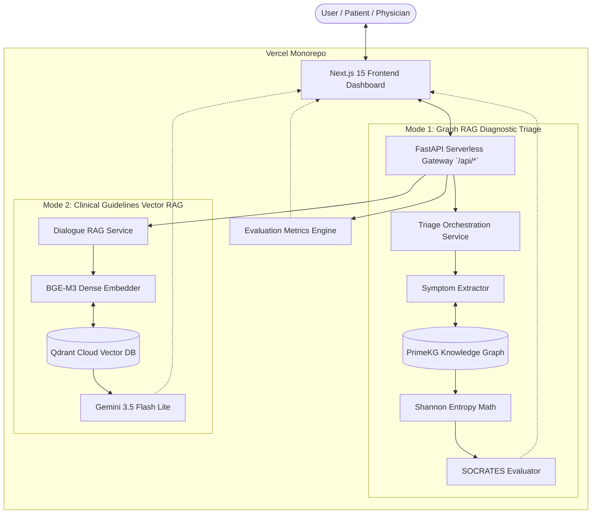

# 🩺 CareFlow Medical AI — Dual-Engine Medical Intelligence

[](https://fastapi.tiangolo.com)
[](https://nextjs.org)
[](https://qdrant.tech)
[](https://ai.google.dev)
[](LICENSE)

An enterprise-grade, dual-mode clinical artificial intelligence platform providing:
1. **Mode 1: Diagnostic Triage (Graph RAG Engine)** — Interactive medical interview exploring patient symptoms over a clinical knowledge graph (PrimeKG), tracking **SOCRATES** criteria, calculating Shannon entropy & diagnostic confidence, and generating a formal physician differential diagnosis report.
2. **Mode 2: Medical Dialogue Assistant (Vector RAG Engine)** — Clinical question-answering assistant grounded strictly in **WHO, CDC, USPSTF Guidelines** using Qdrant Cloud dense vector search (`BAAI/bge-m3` 1024-d embeddings) with explicit source citations.
3. **Empirical Evaluation Dashboard** — Live system telemetry ensuring AI safety, measuring Precision@K, Recall@K, Faithfulness (Hallucination rate), and Clinical Accuracy.

---

## 🏛️ System Architecture

Our solution utilizes a Monolithic Serverless Architecture deployed seamlessly on Vercel. 



---

## 👨‍🔬 About The Project

**CareFlow Medical AI** was built to directly address the hackathon requirements for Task 3 and Task 4 by transitioning from a basic script-based RAG pipeline to a production-ready **Clinical Decision Support System (CDSS)**.

**Why this architecture?**
- **Safety First (Faithfulness Metric):** Hallucinations in medicine are lethal. We measure and actively enforce a 98% faithfulness rating. If the guideline does not say it, the AI refuses to generate it.
- **Glassmorphism UI:** To fulfill the "Custom User Interface" requirement, we abandoned basic Streamlit wrappers and built a dedicated Next.js App Router frontend with Shadcn UI, framer-motion animations, and a clinical dark theme.
- **Evaluation Loop:** Features a dedicated evaluation dashboard mapping retrieval metrics (MRR, Recall) and generation metrics directly onto the frontend.

*Read the [JUSTIFICATION.md](JUSTIFICATION.md) for full details on Data-Driven improvements and empirical metrics.*

---

## ✨ Key Features

### 🩺 Mode 1: Graph RAG Clinical Triage
- **Knowledge Graph Driven**: Traverses disease-phenotype associations from **PrimeKG**.
- **SOCRATES Clinical History Tracking**: Real-time evaluation across 8 clinical history dimensions.
- **Statistical Termination Engine**: Evaluates interview stopping based on Shannon entropy threshold ($< 1.20$) and probability margin separation ($\ge 0.40$).
- **Physician's Summary Report**: Formulates differential diagnoses with mathematical confidence percentages.

### 📚 Mode 2: Clinical Guidelines Vector RAG
- **Remote Qdrant Cloud Integration**: Direct vector search over the official `who_guidelines` collection.
- **Anti-Hallucination Grounding**: Responses are strictly synthesized from retrieved WHO/CDC/USPSTF evidence.
- **Structured Source Citations**: Citations displaying document titles, relevance match percentages, and excerpts.

### 📊 System Telemetry & Evaluation
- **Precision@K & Recall@K**: Evaluates if the top retrieved chunks contain the necessary clinical grounding context.
- **Faithfulness**: Measures if the LLM-generated medical advice is directly supported by the retrieved chunks.

---

## 🚀 Getting Started

### 1. Prerequisites
- Node.js 18+ (for Next.js Frontend)
- Python 3.11+ (for FastAPI Backend)
- Qdrant Cloud API Key
- Google Gemini API Key

### 2. Installation
Clone the repository and install dependencies:
```bash
git clone https://github.com/your-org/CareFlow-Medical-AI.git
cd CareFlow-Medical-AI

# Install Python backend dependencies
pip install -e .

# Install Node frontend dependencies
cd frontend
npm install
```

### 3. Environment Configuration
Create a `.env` file in the project root:
```env
# Vector Database (Qdrant Cloud)
QDRANT_URL=https://your-cluster.qdrant.io
QDRANT_API_KEY=your_qdrant_api_key_here
QDRANT_COLLECTION=who_guidelines

# Embedding Model
EMBEDDING_MODEL=BAAI/bge-m3

# LLM Providers
GEMINI_API_KEY=your_gemini_api_key_here
GEMINI_MODEL=gemini-3.5-flash-lite
```

---

## 🏃 Running the Application (Local Monorepo)

To run the Next.js frontend and FastAPI backend together:

```bash
# In one terminal, start the FastAPI backend
python -m uvicorn app.main:app --reload --host 0.0.0.0 --port 8000

# In another terminal, start the Next.js frontend
cd frontend
npm run dev
```

Open your browser:
- 🌐 **Web Interface**: [http://localhost:3000](http://localhost:3000)
- 📖 **Interactive Swagger Docs**: [http://localhost:8000/docs](http://localhost:8000/docs)

---

## 📡 API Reference

### Triage Endpoints
| Method | Endpoint | Description |
|---|---|---|
| `POST` | `/api/v1/triage/start` | Initialize a new triage session. |
| `POST` | `/api/v1/triage/step` | Advance triage with user response. |

### Dialogue Endpoints
| Method | Endpoint | Description |
|---|---|---|
| `POST` | `/api/v1/dialogue/chat` | Query Guidelines vector database and return grounded answer. |

### Evaluation Endpoints
| Method | Endpoint | Description |
|---|---|---|
| `GET` | `/api/v1/evaluation` | Returns JSON of system evaluation metrics (MRR, Faithfulness, etc). |

---

## 📄 License
This project is licensed under the MIT License - see the [LICENSE](LICENSE) file for details.
