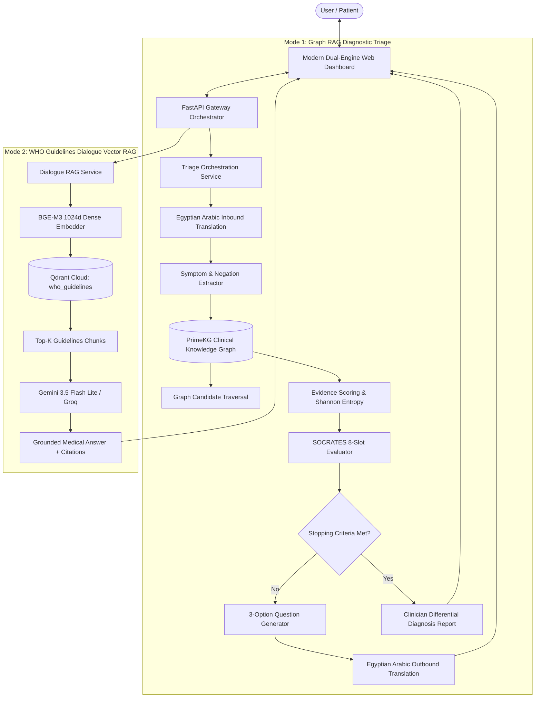

# 🩺 CareFlow Medical AI — Dual-Engine Medical Intelligence

[](https://fastapi.tiangolo.com)
[](https://qdrant.tech)
[](https://ai.google.dev)
[](https://groq.com)
[](LICENSE)

An enterprise-grade, dual-mode clinical artificial intelligence platform providing:
1. **Mode 1: Diagnostic Triage (Graph RAG Engine)** — Interactive medical interview exploring patient symptoms over a clinical knowledge graph (PrimeKG), tracking **SOCRATES** criteria, calculating Shannon entropy & diagnostic confidence, and generating a formal physician differential diagnosis report.
2. **Mode 2: Medical Dialogue Assistant (Vector RAG Engine)** — Clinical question-answering assistant grounded strictly in **WHO (World Health Organization) Guidelines** using Qdrant Cloud dense vector search (`BAAI/bge-m3` 1024-d embeddings) with explicit source citations.

---

## 🏛️ System Architecture



---

## ✨ Key Features

### 🩺 Mode 1: Graph RAG Clinical Triage & Differential Diagnosis
- **Knowledge Graph Driven**: Traverses disease-phenotype associations from **PrimeKG** to dynamically select the highest-yield unasked symptoms.
- **SOCRATES Clinical History Tracking**: Real-time evaluation across 8 clinical history dimensions:
  - **S**ite, **O**nset, **C**haracter, **R**adiation, **A**ssociated symptoms, **T**iming, **E**xacerbating factors, **S**everity.
- **Statistical Termination Engine**: Evaluates interview stopping based on:
  - Minimum (3) and maximum (8) turn bounds.
  - Probability margin separation between Top 1 and Top 2 suspected conditions ($\ge 0.40$).
  - Shannon entropy threshold ($< 1.20$).
  - SOCRATES completeness score ($\ge 5/8$).
- **Structured 3-Option Formulation**: Generates 3 distinct clinical choices (Positive/Severe, Moderate/Partial, Negative/Absent) or accepts free-form text.
- **Multilingual Sandwich Layer**: Native support for **Egyptian Arabic (لهجة مصرية عامية)** and clinical English with automatic translation and entity alignment.
- **Physician's Summary Report**: Formulates differential diagnoses with mathematical confidence percentages, urgency tags (Emergency 🚨, Urgent ⚠️, Routine 📋), and graph traversal evidence paths.

### 📚 Mode 2: WHO Guidelines Dialogue Vector RAG
- **Remote Qdrant Cloud Integration**: Direct vector search over the official `who_guidelines` collection (700 clinical document chunks).
- **Dense Embeddings**: `BAAI/bge-m3` (1024-dimensional normalized vectors).
- **Anti-Hallucination Grounding**: Responses are strictly synthesized from retrieved WHO evidence.
- **Structured Source Citations**: Collapsible citation accordions displaying document titles, guideline sections, relevance match percentages, and excerpt snippets.

### 💻 Modern Interactive Web Dashboard
- Glassmorphism dark clinical theme built with pure CSS and responsive design.
- Instant 1-click mode switcher (🩺 Triage vs 📚 WHO Guidelines).
- Live SOCRATES progress bar, active confirmed/denied symptom chips, and entropy/margin gauges.
- 1-click option pills for rapid patient responses.

---

## 🚀 Getting Started

### 1. Prerequisites
- Python 3.11+
- Qdrant Cloud API Key (with `who_guidelines` collection)
- Google Gemini API Key or Groq API Key

### 2. Installation
Clone the repository and install dependencies:
```bash
git clone https://github.com/careflow-eg/creativa-hackathon-RAG.git
cd creativa-hackathon-RAG

pip install -e .
```

### 3. Environment Configuration
Create a `.env` file in the project root (or copy from `.env.example`):
```env
# Vector Database (Qdrant Cloud)
QDRANT_URL=https://78e9ff09-6d00-4231-8473-9512b20f2582.eu-central-1-0.aws.cloud.qdrant.io
QDRANT_API_KEY=your_qdrant_api_key_here
QDRANT_COLLECTION=who_guidelines

# Embedding Model
EMBEDDING_MODEL=BAAI/bge-m3
VECTOR_SIZE=1024

# LLM Providers
GEMINI_API_KEY=your_gemini_api_key_here
GEMINI_MODEL=gemini-3.5-flash-lite

GROQ_API_KEY=your_groq_api_key_here
GROQ_MODEL=openai/gpt-oss-120b
```

---

## 🏃 Running the Application

### Option A: Launch the Web Dashboard & API
Start the FastAPI server:
```bash
python -m uvicorn app.main:app --reload --host 0.0.0.0 --port 8000
```
Open your browser:
- 🌐 **Web Interface**: [http://localhost:8000](http://localhost:8000)
- 📖 **Interactive Swagger Docs**: [http://localhost:8000/docs](http://localhost:8000/docs)
- 🩺 **Health Check**: [http://localhost:8000/health](http://localhost:8000/health)

### Option B: Run via Interactive Terminal CLI
Run Mode 1 (Graph RAG Triage in English or Arabic):
```bash
# English Triage
python scripts/run_chatbot_cli.py --mode triage --lang en

# Egyptian Arabic Triage
python scripts/run_chatbot_cli.py --mode triage --lang ar
```

Run Mode 2 (WHO Guidelines Dialogue RAG):
```bash
python scripts/run_chatbot_cli.py --mode dialogue
```

---

## 📡 API Reference

### Mode 1: Graph RAG Triage Endpoints
| Method | Endpoint | Description |
|---|---|---|
| `POST` | `/api/v1/triage/start` | Initialize a new triage session with language selection (`en` or `ar`). |
| `POST` | `/api/v1/triage/step` | Advance triage with user response (`"1"`, `"2"`, `"3"`, or text). Returns next question + options or final doctor report. |
| `POST` | `/api/v1/triage/reset` | Reset active session state. |

#### Sample Request (`/api/v1/triage/step`):
```json
{
  "session_id": "sess_12345",
  "message": "I've had severe chest tightness and shortness of breath since morning",
  "language": "en"
}
```

#### Sample Response:
```json
{
  "session_id": "sess_12345",
  "is_complete": false,
  "message": "I'm sorry you are experiencing chest tightness. Does the pain radiate to your left arm or jaw?",
  "options": [
    "Yes, pain radiates strongly to my left arm or jaw",
    "Mild radiation or tingling in shoulder",
    "No radiation, pain is only in the center of my chest"
  ],
  "target_symptom": "radiation of pain to left arm",
  "socrates_tracker": {
    "site": true,
    "onset": true,
    "character": true,
    "radiation": false,
    "associated_symptoms": true,
    "time_course": true,
    "exacerbating_relieving": false,
    "severity": true
  },
  "socrates_score": 5,
  "turn_count": 2,
  "positive_symptoms": ["chest tightness", "shortness of breath"]
}
```

---

### Mode 2: WHO Guidelines Dialogue Endpoint
| Method | Endpoint | Description |
|---|---|---|
| `POST` | `/api/v1/dialogue/chat` | Query WHO Guidelines vector database and return grounded answer with citations. |

#### Sample Request (`/api/v1/dialogue/chat`):
```json
{
  "query": "What are WHO guidelines for poliovirus laboratory containment?",
  "top_k": 3
}
```

#### Sample Response:
```json
{
  "query": "What are WHO guidelines for poliovirus laboratory containment?",
  "answer": "According to the WHO guidelines, poliovirus laboratory containment requires...",
  "sources": [
    {
      "source_file": "11th Meeting of the South-East Asia Regional Certification Commission for Polio Eradication (SEA-RCCPE)",
      "section": "Poliovirus laboratory containment",
      "relevance_score": 0.685,
      "snippet": "All Member States are completing new surveys of biomedical laboratories..."
    }
  ],
  "chunks_retrieved": 3
}
```

---

## 🧪 Automated Testing

Run the comprehensive test suite with pytest:
```bash
pytest tests/test_dual_mode_chatbot.py -v
```

**Test Coverage Includes:**
- PrimeKG knowledge graph structure and disease-phenotype node validation.
- Graph candidate exploration and traversal ranking.
- Heuristic evidence scoring and Shannon entropy mathematical calculation.
- SOCRATES completeness and statistical termination boundary conditions.
- Triage REST API start and multi-turn step verification.
- WHO Guidelines Qdrant vector retrieval and grounded response generation.

---

## 📄 License
This project is licensed under the MIT License - see the [LICENSE](LICENSE) file for details.
