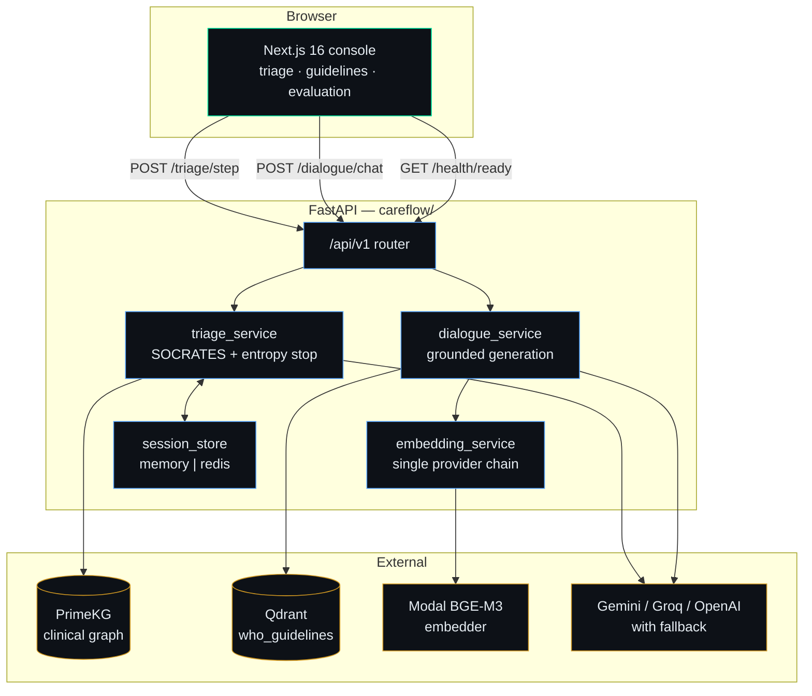
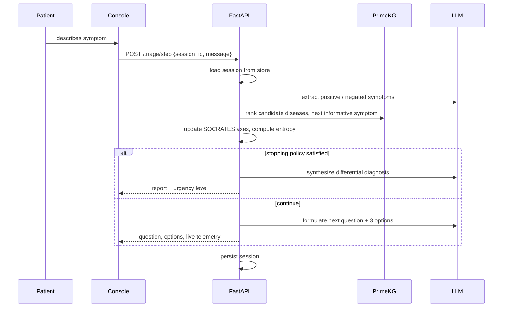

# CareFlow — Dual-Mode Clinical AI

[](https://nextjs.org/)
[](https://fastapi.tiangolo.com/)
[](https://qdrant.tech/)
[](#testing)

**Live:** <https://careflow-medical-ai.vercel.app> · API health:
[`/api/v1/health/ready`](https://careflow-medical-ai.vercel.app/api/v1/health/ready)

Two retrieval modes over one clinical backend:

- **Mode 1 — Diagnostic triage (Graph RAG).** A multi-turn interview that traverses a
  clinical knowledge graph, tracks the eight SOCRATES axes of a pain history, and stops
  on an entropy/coverage policy rather than a fixed question count.
- **Mode 2 — Guideline retrieval (Vector RAG).** Grounded answers over indexed clinical
  guidelines in Qdrant, with the retrieved passages attached to every response.

---

## Architecture



### Triage interview loop



---

## Quick start

```bash
# 1. Python environment
uv venv && uv pip install -e ".[dev,eval]"

# 2. Secrets — at minimum QDRANT_URL, QDRANT_API_KEY, and one LLM key
cp .env.example .env && $EDITOR .env

# 3. Node dependencies
npm install

# 4. Run frontend (3000) + backend (8000) together
npm run dev:all
```

Open <http://localhost:3000>. The status pill in the header reports whether Qdrant, the
embedder, and the knowledge graph are actually reachable.

Run the pieces separately if you prefer:

```bash
npm run dev:api   # FastAPI  — http://127.0.0.1:8000/docs
npm run dev       # Next.js  — http://localhost:3000
```

---

## Evaluation

Retrieval and generation are measured **separately**, because they fail for different
reasons and a blended score hides which stage is at fault.

### Retrieval benchmark (no API quota required)

```bash
python scripts/benchmark_retrieval.py --top-k 5
```

Scores 8 labeled in-domain clinical queries from
`data/benchmarks/retrieval_benchmark.json`, each annotated with the guideline that must
be retrieved and the keywords the answer requires, run through the exact production path
(`RETRIEVAL_SCORE_THRESHOLD` filter, then cross-encoder rerank). No LLM is involved, so
this runs free and fast as a regression check.

| Metric | Value |
|---|---|
| top-1 accuracy | 1.000 |
| MRR | 1.000 |
| precision@5 | 1.000 |
| keyword recall | 1.000 |
| hit rate | 1.000 |

Every retrieval metric this benchmark can express is at ceiling. `--sweep` and
`--no-rerank` reproduce how each stage (score threshold, cross-encoder) contributes to
that — see [Data-driven improvements](#data-driven-improvements) below.

### Full RAG evaluation (ragas — needs a judge model)

```bash
python scripts/evaluate_rag.py --top-k 5                       # domain-matched (default)
python scripts/evaluate_rag.py --dataset meddata --sample-size 10  # broad QA, refusal check
python scripts/evaluate_rag.py --retrieval-only                # skip LLM-judged metrics entirely
```

Two question sources, because one dataset can't honestly serve both jobs:

- `benchmark` (default) reuses the retrieval benchmark's 8 clinical queries, which do
  retrieve real context, so `faithfulness` and `answer_relevancy` measure something
  meaningful. It has no curated reference answer (only `expected_keywords`), so
  `context_recall` and `answer_similarity` are intentionally left unmeasured rather than
  approximated.
- `meddata` has real reference answers, so it's the only source that can score
  `context_recall` and `answer_similarity`. Most of its questions fall outside the
  indexed WHO/CDC/USPSTF guidelines, so at a well-tuned score threshold it mostly
  retrieves nothing — it verifies the system says "insufficient information" instead of
  guessing, which is a real and useful check, but not an in-domain generation-quality
  measurement, so it writes to its own file rather than the headline one.

Writes `careflow/artifacts/evaluation_results.json` (benchmark) or
`evaluation_results_meddata.json` (meddata). `GET /api/v1/evaluation` serves the former,
rendered in the Evaluation tab.

> The dashboard has **no fallback values**. A metric that was not measured renders as
> `—`, and a missing run renders the command to produce one. It never substitutes a
> plausible-looking number.

Current measured generation quality (`--dataset benchmark`, 8/8 scored):

| Metric | Value |
|---|---|
| faithfulness | 0.653 |
| answer relevancy | 0.803 |
| mean latency | 8.77s |

`context_precision`, `context_recall`, and `answer_similarity` are `—` (not measured) for
this dataset by design — see above. Getting a real faithfulness number required fixing
three bugs that only surfaced by actually running the judge end to end; see
[Data-driven improvements](#data-driven-improvements) #5.

---

## Data-driven improvements

Each of these came from a measurement, not a guess.

### 1. The knowledge base contained no clinical guidelines

Inspecting the live collection showed all 700 indexed chunks were WHO *administrative*
documents — Immunization Technical Advisory Group minutes, Polio Certification
Commission minutes, Global Action Plan progress reports, epidemiological bulletins.
Not one treatment guideline.

Root cause: `ingest_document()` chunked text, built payload metadata, logged
`"Document ingested successfully"`, and returned — with no embedding call and no upsert.
It never wrote anything, so every ingestion reported success while persisting nothing.

After repairing the pipeline and ingesting real guidelines (top-1 cosine):

| Query | Before | After | Δ |
|---|---|---|---|
| blood pressure threshold | 0.4481 | 0.6593 | **+0.2112** |
| first-line antihypertensives | 0.4524 | 0.6904 | **+0.2380** |
| diabetes diagnostic criteria | 0.4736 | 0.6583 | **+0.1847** |
| asthma maintenance therapy | 0.4563 | 0.6465 | **+0.1902** |

Correct top-1 source went **0/4 → 4/4**. End to end, *"What blood pressure threshold
defines hypertension?"* moved from *"The provided WHO guidelines do not contain
sufficient information"* to a grounded answer citing WHO Guideline – Hypertension 2021
at 0.7235.

### 2. 80% of retrieved context was noise

The benchmark showed precision@5 = 0.200 while top-1 accuracy and MRR were both 1.000:
retrieval found the right document every time, but four of five chunks passed to the
generator were irrelevant. Sweeping `RETRIEVAL_SCORE_THRESHOLD` over the labeled set
(`python scripts/benchmark_retrieval.py --sweep 0.20,0.35,0.45,0.50,0.55,0.60,0.65`,
bi-encoder score only, so this isolates the threshold from the reranker in #4 below):

| Threshold | precision@5 | chunks/query | keyword recall |
|---|---|---|---|
| 0.20 | 0.200 | 5.00 | 8/8 |
| 0.35 | 0.200 | 5.00 | 8/8 |
| 0.45 | 0.375 | 3.75 | 8/8 |
| 0.50 | 0.692 | 2.00 | 8/8 |
| **0.55** | **1.000** | **1.00** | **8/8** |
| 0.60 | 1.000 | 1.00 | 8/8 |
| 0.65 | 0.625 | 0.62 | 5/8 |

Keyword recall holds at 8/8 through 0.60 — nothing clinically needed is lost getting to
perfect precision. Past 0.65 real answer content starts getting cut, not just noise
(keyword recall drops to 5/8, top-1 accuracy to 0.625). Default raised 0.20 → **0.55**:
precision@5 **0.200 → 1.000**, top-1 accuracy and MRR unchanged at 1.000. 0.55 is chosen
over the equally-scoring 0.60 for the larger margin to that 0.65 cliff — the sweep covers
8 queries against 3 clinical documents, so a threshold with no safety margin is a
regression waiting to happen on a slightly different query.

### 3. The two RAG modes picked their final context differently — and the fix taught us the threshold, not the reranker, was doing the precision work

The triage graph (`retrieval_service.py`) already retrieved a wide candidate pool and
reranked it with a cross-encoder (`BAAI/bge-reranker-v2-m3`) before generation. The
guideline Q&A path (`dialogue_service.search_guidelines`, used by the benchmark above and
the Guidelines console) never did — it queried Qdrant once and returned raw vector order.
Wired the same reranker in, with an ablation to check what it actually bought:

| Configuration | precision@5 | top-1 accuracy | MRR |
|---|---|---|---|
| threshold 0.50, no rerank | 0.692 | 1.000 | 1.000 |
| threshold 0.50, **with rerank** | 0.692 | 1.000 | 1.000 |
| threshold 0.55, no rerank | 1.000 | 1.000 | 1.000 |
| threshold 0.55, **with rerank** | 1.000 | 1.000 | 1.000 |

No measurable change on this benchmark — reproducible with
`python scripts/benchmark_retrieval.py --no-rerank` vs. the default. The reason is
structural, not a bug: at threshold ≥ 0.50 only 1-2 candidates survive the vector filter
per query, and reranking one or two items can't change which document they came from.
The reranker earns its keep on a wider, noisier candidate pool (low threshold, many
source documents) — which this 3-document benchmark doesn't exercise, but the full
700-chunk collection (nine WHO administrative sources plus the three clinical guidelines)
does. It's kept as the default for architectural consistency between both RAG modes and
as a second precision stage should the threshold alone stop being sufficient as the
corpus grows; the honest finding here is that the threshold sweep in #2, not the
reranker, is what earned the current perfect score.

### 4. Retrieval could fail silently

Both embedding paths ended in a deterministic pseudo-random vector when no provider was
reachable. A random query vector searched against a real BGE-M3 index returns arbitrary
chunks with plausible similarity scores, which the LLM then answers over confidently —
no exception, no empty result, just silently wrong medical retrieval.

Replaced with a single provider chain that raises `EmbeddingUnavailableError` instead.
The `mock` provider still exists for tests but is excluded from the automatic chain, so
it can never be selected implicitly. `/health/ready` now probes the real embedder, and
the UI surfaces its status.

### 5. Three bugs were hiding the real faithfulness score, discovered only by running the judge end to end

Every prior "full RAG evaluation" in this project reported `n_scored: 0, judge: null` —
silently skipped, not measured. Actually running `evaluate_rag.py --dataset benchmark`
surfaced three independent, real bugs, each masking the next:

1. **`GROQ_MODEL` was misconfigured in `.env`** (`gpt-oss-120b`, missing Groq's required
   `openai/` provider prefix) → every Groq call 404'd with `model_not_found`. This is the
   model used for both the ragas judge *and* the app's own Groq fallback path, so this
   silently defeated the dual-LLM fallback architecture, not just evaluation.
2. **`answer_relevancy` requests `n=3`** (its default `strictness`) in one completion call
   to generate candidate questions; Groq's OpenAI-compatible endpoint rejects any `n>1`.
   This failed deterministically on every sample, and `RunConfig(max_retries=10)` retried
   each failure with backoff before giving up — burning 17+ minutes to fail. Fixed by
   constructing `AnswerRelevancy(strictness=1)`.
3. **The judge embedder pointed at `models/embedding-001`**, which 404s on the current
   Gemini API (`models/gemini-embedding-001` is live). Moved to a config setting
   (`RAGAS_JUDGE_EMBEDDING_MODEL`) rather than re-hardcoding the corrected literal.

With all three fixed, a fourth issue showed up in the *result*, not the run: faithfulness
scored 0.2034 — implausibly low next to a 1.0 sanity-check on a single synthetic sample.
The cause: `answer_question()` returns each citation's `snippet` truncated to 300 chars
for UI display, and the evaluation harness was feeding that truncated snippet to ragas as
the generation context — checking the answer against less evidence than the LLM actually
saw (the prompt uses the full chunk text). Added a `full_text` field alongside `snippet`
and pointed the harness at it instead:

| | faithfulness | answer_relevancy |
|---|---|---|
| against truncated snippet | 0.2034 | 0.8044 |
| **against full chunk text** | **0.6526** | 0.8031 |

**3.2× on the same 8 answers, same generator, same judge** — nothing about generation
quality changed between those two rows, only what the metric was allowed to see. Per-query
faithfulness (0.33–0.86) now also carries real signal instead of noise: it tracks how much
of the single retrieved chunk (§2 raised the threshold enough that most queries return
exactly one) actually covers the question, lowest on the two asthma queries where one
chunk doesn't fully substantiate a "well-structured, comprehensive answer." That's a
legitimate lead for the next iteration — whether generation breadth should get its own
floor independent of the retrieval precision threshold — not something this pass changed.

---

## Project layout

```
careflow/              FastAPI backend (single canonical package)
  api/v1/endpoints/    route handlers
  core/                config, constants, logging, version
  services/            embedding, retrieval, dialogue, triage, session store
  artifacts/           evaluation + benchmark output
src/                   Next.js frontend (App Router)
  app/                 layout, page, design tokens
  components/console/  triage, guidelines, telemetry, evaluation
  lib/api.ts           typed client mirroring the backend schemas
api/index.py           Vercel serverless entrypoint
scripts/               ingestion, evaluation, benchmark, CLI tools
data/benchmarks/       labeled retrieval benchmark
tests/                 unit (default) + integration (opt-in)
```

Three directories in this repo could reasonably be called "app": `src/app/` is required
by the Next.js App Router, `api/` is required by Vercel's Python builder, and the FastAPI
package is the only one free to be named — hence `careflow/`.

---

## Testing

```bash
pytest                    # 37 unit tests, ~14s, no network
pytest -m integration     # live Qdrant + LLM APIs, real keys, consumes quota
npx tsc --noEmit          # frontend types
npx eslint src            # frontend lint
```

Integration tests are deselected by default: they require live services and exhaust the
Gemini free tier (15 requests/minute).

---

## Configuration

Every setting has a working default in `careflow/core/config.py` and is overridable by
environment variable. See `.env.example` for the annotated list. The ones that matter
most:

| Variable | Default | Why it matters |
|---|---|---|
| `EMBEDDING_PROVIDER` | `auto` | `auto` → hosted, then local. Pin to `remote` on any host without room for a ~2.3GB local model download (serverless, disk-constrained dev boxes) — `local` is a same-process fallback, not a bound, so `auto`'s worst case is still that download. `mock` is tests-only and never auto-selected. |
| `RETRIEVAL_SCORE_THRESHOLD` | `0.55` | Tuned from the benchmark; see above. |
| `SESSION_BACKEND` | `auto` | **Must be `redis` on serverless** — see below. |
| `ALLOWED_ORIGINS` | `*` | A wildcard disables credentialed CORS, per the Fetch spec. |
| `GUARDRAILS_ENABLED` | `True` | Master switch for [Guardrails](#guardrails). Off only to measure raw model behaviour. |
| `GUARDRAIL_EMERGENCY_ESCALATION` | `True` | Escalate suspected emergencies instead of answering. |
| `GUARDRAIL_BLOCK_INJECTION` | `True` | Refuse queries attacking the grounding instruction. |
| `GUARDRAIL_BLOCK_UNGROUNDED` | `True` | Replace answers generated with no retrieved context. |
| `GUARDRAIL_NUMERIC_CHECK` | `True` | Flag doses/thresholds absent from every retrieved passage. |

---

## Deployment

### Vercel

```bash
vercel link
vercel env add QDRANT_URL production      # repeat per secret
vercel --prod
```

`vercel.json` routes `/api/*` to `api/index.py`; the Next.js rewrite is skipped when
`VERCEL` is set, so it only proxies to localhost during development.

**Set `SESSION_BACKEND=redis` with a reachable `REDIS_URL` before deploying.** Serverless
invocations are not guaranteed to reuse a process, so in-memory sessions make `/triage/step`
start a fresh interview on every turn — the patient's answers silently vanish.

The heavy ML stack (`torch`, `sentence-transformers`) is deliberately excluded from
`requirements.txt` because it exceeds Vercel's 250MB function limit. Production embeds
through `EMBEDDER_ENDPOINT_URL`; install `.[local-embeddings]` to run fully offline.

### Container (Railway, Fly, any Docker host)

```bash
docker build -t careflow . && docker run -p 8000:8000 --env-file .env careflow
```

---

## Safety

Clinical decision support for demonstration purposes. Not a medical device, not a
diagnosis, and not a substitute for assessment by a qualified clinician.

### Guardrails

`careflow/services/guardrails.py` enforces safety **outside** the model. The grounding
instruction in the system prompt ("answer only from the retrieved context") is a request
the model can decline — these checks hold regardless of what it emits, which is exactly
when they matter. All are deterministic and LLM-free: a guardrail that needs its own model
call fails precisely when the model is already failing, and taxes every request.

| Stage | Guardrail | Behaviour |
|---|---|---|
| Input | Emergency escalation | Returns emergency-services guidance instead of a guideline lookup. Fires **before** retrieval, so it costs no embedding/Qdrant/LLM call. |
| Input | Prompt injection | Refuses attempts to override grounding, reassign the model's role, or exfiltrate the system prompt. |
| Output | Ungrounded answer | An answer generated from **zero** retrieved chunks is replaced with the refusal message. |
| Output | Clinical numeric check | Doses/thresholds asserted in the answer but present in no retrieved passage are flagged to the user. |
| Output | Disclaimer | Appended if the model dropped it. |

Emergency detection requires **both** a first-person distress signal **and** a red-flag
symptom. This matters more than it sounds: a guidelines assistant is *expected* to be asked
*"What does WHO recommend for chest pain evaluation?"*, and a symptom-keyword-only rule
would escalate every such query — training users to ignore the one warning that must never
be ignored. Self-harm patterns deliberately bypass the distress requirement, because the
cost of a false negative there is not symmetric with the cost of a false alarm.

The numeric check compares on the numeric token, not the formatted string, so a passage
reading *"130 mmHg or higher"* supports an answer saying *"≥130 mmHg"*; it reads the full
chunk text rather than the truncated UI citation snippet; and it ignores bare numbers so
list markers and years are never mistaken for clinical claims. It **warns rather than
blocks** — one unverified figure shouldn't discard an otherwise sound answer.

Verified against the live pipeline: **0 false positives across all 8 benchmark queries**,
0 spurious numeric warnings on the three number-heavy ones, and retrieval metrics unchanged
at 1.000. Covered by 33 unit tests (`tests/unit/test_guardrails.py`), weighted toward the
false-positive cases.

Every guardrail is individually switchable (`GUARDRAIL_*` in [Configuration](#configuration)),
with `GUARDRAILS_ENABLED` as a master switch so the evaluation harness can measure raw
model behaviour without this layer masking it. All default **on**.

The response carries a `guardrails` object reporting what fired, so a client can tell
guardrail replacement text from a retrieved answer — an emergency escalation should be
presented far more prominently than an ordinary response.
